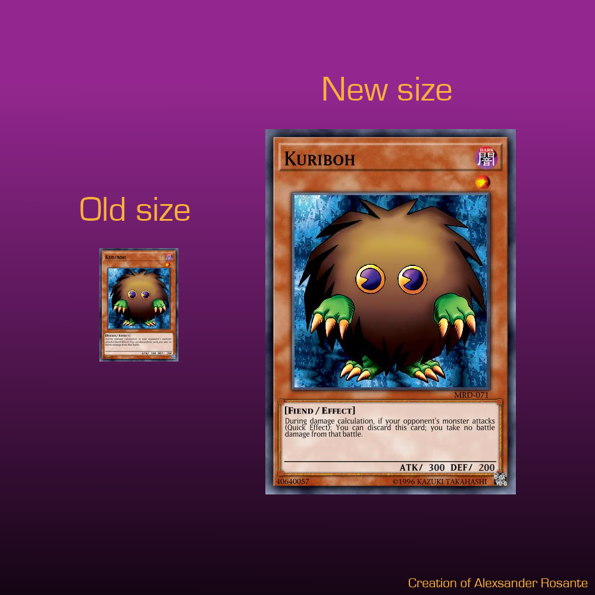

# [EDOPro/Ygopro](https://discord.gg/ygopro-percy) hd cards downloader

This program automamize the process of acess [YGO Cards Databese](https://db.ygoprodeck.com/), choose of a card you want a better resolution pic, download the image and put it into your game's pics folder. The method is simple, a python script gets a list of cards ids in a ydk file and use link manipulation to download card per card directly into the pics folder. I pretend to expand this project to a deck containing all tcg/ocg cards and adjust the algorithim to download field's image too.

The size of a standart card pic is 177x254 that downloads automaticaly when you open the game, the pics you download with this program has the resolution of 421x614 or 139% larger and 142% taller. This upscale helps with runing your game in fullscreen.

### Instalation:
- Download [exe](hd_cards_downloader.exe) (~5 MB) or [py](hd_cards_downloader.py) (1 kb) if you have python 3 installed in your computer;
- Extract to your EDOPro folder;
- Double-click exe or py file;
- Insert a valid deck name (without .ydk);
- If you are in deck edit screen, just get back to main menu to reload the pics;

### Download all cards pics (officials tgc/ocg):
- I recommend you delete all cards pics before you do what follow;
- Download [allcards.ydk](allcards.ydk) file;
- Drop it into your game's deck folder;
- Open the program and insert: *allcards*;
- Wait until done. It can take a while because it's over nine thousand cards.

### You can help me:
With the release of new cards, two problems appear:
1 - The allcards.ydk don't cover all cards;
2 - The card's name can change from OCG to TCG (The game considers TCG name as default);
